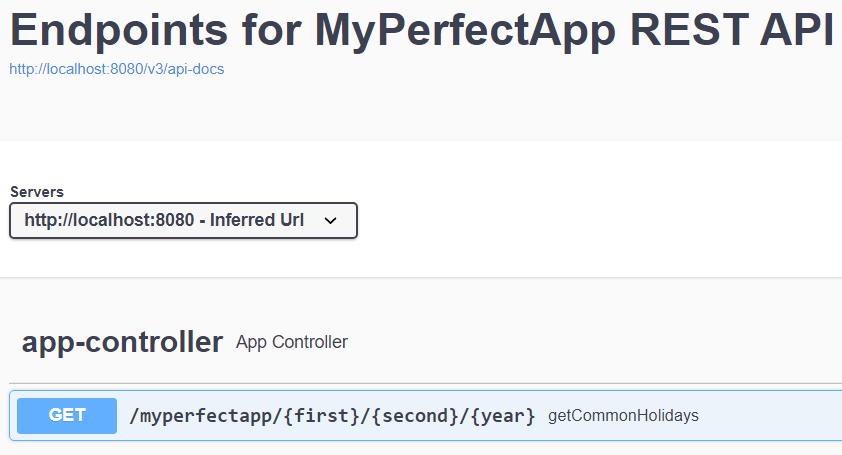

## MyPerfectApp

### Description

REST API that allows to enter two countries and year to find their common holidays.
https://date.nager.at/ is used as a source of data.

### Setup

<<<<<<< HEAD
<<<<<<< HEAD
=======
>>>>>>> b553233 (changed service class)
Clone this repository.

### Usage

1. Open command line/console of Your system with a user account that has admin rights
2. Go to the directory where the project was previously cloned
3. Run the app via command `mvnw spring-boot:run`

After running endpoint description is available in [Swagger](http://localhost:8080/swagger-ui/index.html)

## Tests

Run the unit tests using the command  `mvnw test`
<<<<<<< HEAD
=======
To run this program, simply clone this repository.
>>>>>>> 10574f2 (Create README.md)
=======
>>>>>>> b553233 (changed service class)
